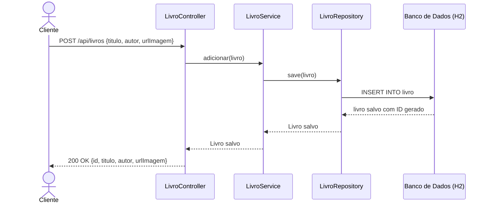
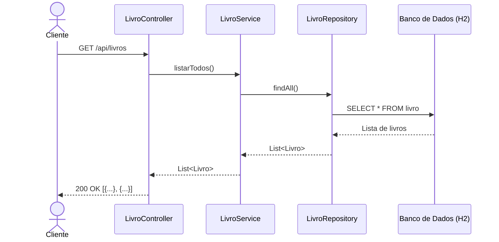
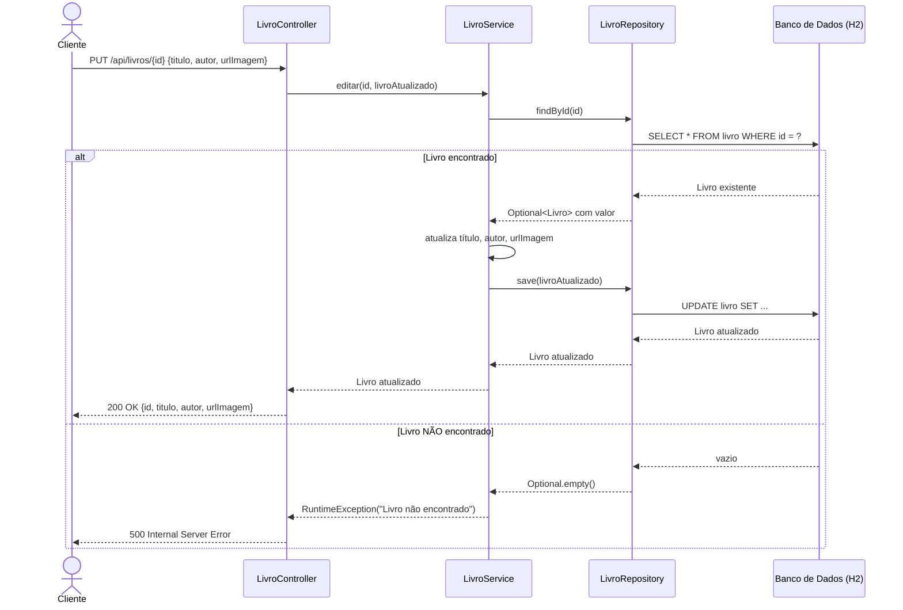
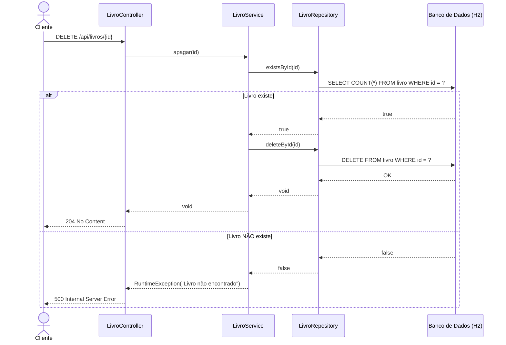

# RTM.md — Matriz de Rastreabilidade de Requisitos

> **Projeto:** Sistema de Cadastro e Gerenciamento de Livros  
> **Cobertura de testes:** 88% (JaCoCo)  
> **Total de testes:** 23  

---

## 1. Requisitos Funcionais

| ID | Requisito | Descrição |
|----|-----------|-----------|
| RF01 | Adicionar Livro | O sistema deve permitir cadastrar um novo livro com título, autor e URL de imagem |
| RF02 | Listar Livros | O sistema deve retornar todos os livros cadastrados |
| RF03 | Editar Livro | O sistema deve permitir atualizar os dados de um livro existente |
| RF04 | Apagar Livro | O sistema deve permitir remover um livro pelo seu ID |
| RF05 | Validar Livro Inexistente (Editar) | O sistema deve lançar erro ao tentar editar um livro que não existe |
| RF06 | Validar Livro Inexistente (Apagar) | O sistema deve lançar erro ao tentar apagar um livro que não existe |

---

## 2. Matriz de Rastreabilidade

| ID Requisito | Teste | Classe | Tipo | Resultado |
|---|---|---|---|---|
| RF01 | `deveAdicionarLivroComSucesso` | `LivroServiceTest` | Integração | ✅ PASS |
| RF01 | `deveCriarLivro` | `LivroControllerTest` | Caixa Preta | ✅ PASS |
| RF01 | `deveAdicionarVariosLivros[1]` O Pequeno Príncipe | `LivroServiceTest` | Parametrizado | ✅ PASS |
| RF01 | `deveAdicionarVariosLivros[2]` 1984 | `LivroServiceTest` | Parametrizado | ✅ PASS |
| RF01 | `deveAdicionarVariosLivros[3]` A Revolução dos Bichos | `LivroServiceTest` | Parametrizado | ✅ PASS |
| RF01 | `deveAdicionarVariosLivros[4]` Sapiens | `LivroServiceTest` | Parametrizado | ✅ PASS |
| RF01 | `deveAdicionarVariosLivros[5]` O Alquimista | `LivroServiceTest` | Parametrizado | ✅ PASS |
| RF02 | `deveListarTodosOsLivros` | `LivroServiceTest` | Integração | ✅ PASS |
| RF02 | `deveRetornarListaVaziaQuandoNaoHaLivros` | `LivroServiceTest` | Caixa Branca | ✅ PASS |
| RF02 | `deveRetornar200EListaVazia` | `LivroControllerTest` | Caixa Preta | ✅ PASS |
| RF02 | `deveListarLivrosAposInsercao` | `LivroControllerTest` | Caixa Preta | ✅ PASS |
| RF03 | `deveEditarLivroComSucesso` | `LivroServiceTest` | Integração | ✅ PASS |
| RF03 | `deveEditarLivro` | `LivroControllerTest` | Caixa Preta | ✅ PASS |
| RF03 | `deveEditarTituloComDadosDiferentes[1]` | `LivroServiceTest` | Parametrizado | ✅ PASS |
| RF03 | `deveEditarTituloComDadosDiferentes[2]` | `LivroServiceTest` | Parametrizado | ✅ PASS |
| RF03 | `deveEditarTituloComDadosDiferentes[3]` | `LivroServiceTest` | Parametrizado | ✅ PASS |
| RF04 | `deveApagarLivroComSucesso` | `LivroServiceTest` | Integração | ✅ PASS |
| RF04 | `deveApagarLivro` | `LivroControllerTest` | Caixa Preta | ✅ PASS |
| RF05 | `deveLancarExcecaoAoEditarLivroInexistente` | `LivroServiceTest` | Caixa Branca | ✅ PASS |
| RF05 | `deveRetornarErroAoEditarInexistente` | `LivroControllerTest` | Caixa Preta | ✅ PASS |
| RF06 | `deveLancarExcecaoAoApagarLivroInexistente` | `LivroServiceTest` | Caixa Branca | ✅ PASS |
| RF06 | `deveRetornarErroAoDeletarInexistente` | `LivroControllerTest` | Caixa Preta | ✅ PASS |
| — | `contextLoads` | `LivrosApplicationTests` | Context Load | ✅ PASS |

**Cobertura de requisitos: 6/6 (100%)**

---

## 3. Resumo por Tipo de Teste

| Tipo | Quantidade | Descrição |
|------|-----------|-----------|
| Integração | 4 | Fluxo completo com banco de dados real (H2) |
| Caixa Branca | 3 | Caminhos internos do código (branches) |
| Caixa Preta (E2E) | 7 | Requisições HTTP reais à API |
| Parametrizados | 8 | Múltiplos cenários com dados variados |
| Context Load | 1 | Verifica inicialização da aplicação |
| **Total** | **23** | |

---

## 4. Diagramas UML de Sequência

### RF01 — Adicionar Livro (POST /api/livros)

---

### RF02 — Listar Livros (GET /api/livros)

---

### RF03 — Editar Livro (PUT /api/livros/{id})

---

### RF04 — Apagar Livro (DELETE /api/livros/{id})

---

## 5. Evidência de Cobertura

Relatório gerado automaticamente pelo **JaCoCo 0.8.12** após execução de `./mvnw test`:

| Pacote | Cobertura de Linhas |
|--------|-------------------|
| `com.example.livros.service` | **100%** |
| `com.example.livros.controller` | **100%** |
| `com.example.livros` | 37% |
| **Total** | **88%** ✅ (mínimo exigido: 80%) |

> Relatório completo disponível em `target/site/jacoco/index.html`

